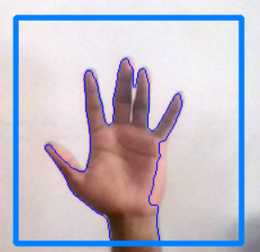
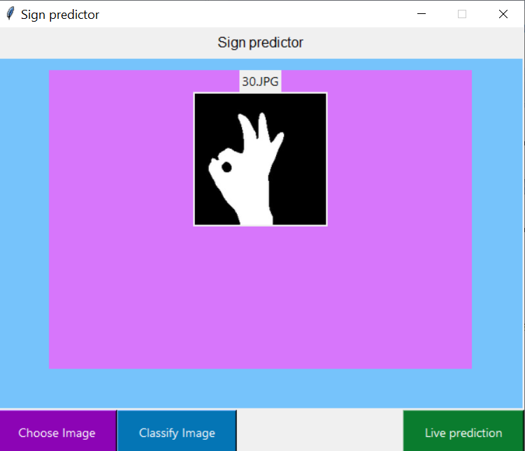
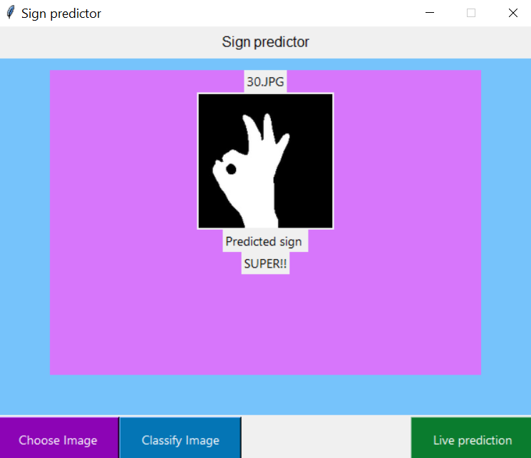
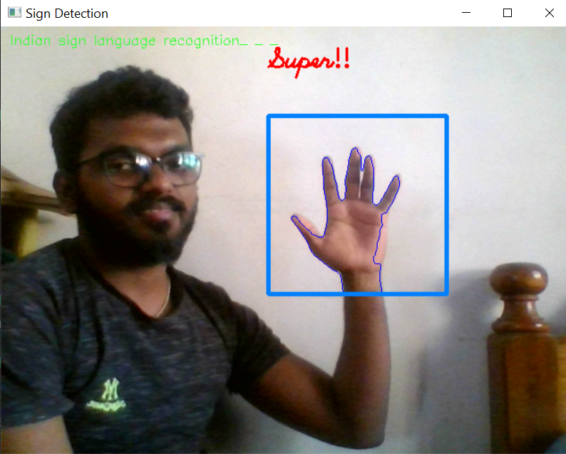

<link rel="stylesheet" href="https://fonts.googleapis.com/icon?family=Material+Icons">
<link rel="stylesheet" href="assets/style.css" >

<a href="https://suhasbrao.github.io/" >
    <button class="btn"><i class="material-icons">home</i></button></a>
  <a href="https://suhasbrao.github.io/FaceDetection/" >
    <button class="btn"><i class="material-icons">arrow_back_ios</i></button></a>
  <a href="https://suhasbrao.github.io/Snake-game/" >
    <button class="btn"><i class="material-icons">arrow_forward_ios</i></button></a>

<h2>Description</h2>

The recognition of the sign language is done using a CNN(Convolutional Neural Network) model which is trained on a dataset containing 35 classes among which 26 are for alphabets and remaining are for numbers. A custom Dataset was created for training purposes. Tensorflow has been utilized to train the model.
 Below images show the foreground extraction from frames (which was used for dataset creation).

Sequential model with three *Convo2D* layers, three *MaxPool2D* layers and three dense layers with *relu* activation funcion has been used. The output Dense layer has softmax activation function with 35 neurons.
[Adam](https://keras.io/api/optimizers/adam/) optimizer with [categorical crossentropy](https://www.tensorflow.org/api_docs/python/tf/keras/losses/CategoricalCrossentropy) loss function is used. The model is then trained for 10 epochs. The model was later trained for 25 epochs and got more accuracy.

<h2>Strucure of repo</h2>

The repository contains the following structure.
- README.md - This is a markdown file which contains details about the project.
- Main scripts - This folder contains the main script files which can be used to either generate the model or for prediction with the model.
- Mytrials - This folder contains the files which which were used while training the model and also for testing the codes.

<!--[Webcam capture](/images/Webcamcapture.png)
 -->

<h2>Future Work</h2>

At this point of time the model is able to recognize gestures from static images. The prediction is above 89% accurate for static inputs(images). We are working to produce a system which can recognize gestures shown by user in real time.
Image is captured from webcam and only the hand reagion of that image is given as input for the CNN model. The model must recognize the sign.
We are still working to capture the hand region from live webcam.

<h2>References</h2> 

- [Real-Time Recognition of Indian Sign Language](https://ieeexplore.ieee.org/document/8862125)
- [Continuous dynamic Indian Sign Language gesture recognition with invariant backgrounds](https://ieeexplore.ieee.org/document/7275945)
- [Machine learning Techniques for Indian Sign Language Recognition](https://ieeexplore.ieee.org/document/8454988)
- [Real time Conversion of Sign Language using Deep Learning for Programming Basics](https://ieeexplore.ieee.org/document/9087272)

Above are few of the papers our team referred to do this project. We have also referred several other Conference papers.
**Also you can refer this article [Sign language recognition using Python and Opencv](https://data-flair.training/blogs/sign-language-recognition-python-ml-opencv/)**

<h2>Glimpse of the Application<h2>

      
      
      
      
      

        
        
        
        
      

      

        
        
        
        
      

